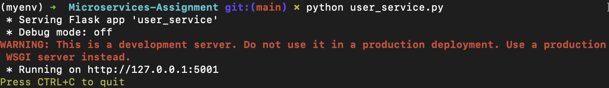
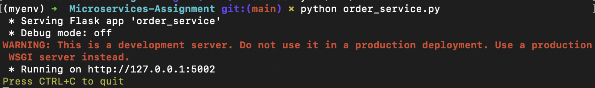
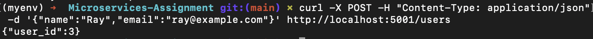
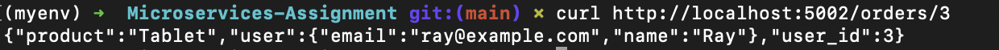

# Microservices Architecture Assignment

Two Flask services:
- **User Service** (port 5001) provides endpoints to create and retrieve users and stores user data in a simple in-memory dictionary.
- **Order Service** (port 5002) provides endpoints to create and retrieve orders.

## Setup
```bash
# Create a virtual environment
python -m venv myenv

# Activate the virtual environment
source myenv/bin/activate      # Windows: myenv\bin\activate

# Install Flask
pip install flask
pip install requests
```

## Running the Services
### Start the User Service


### Start the Order Service


## Example Requests

### Create a User


### Get a User


### Create an Order


### Get an Order

