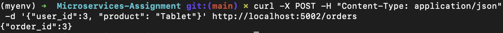

# Microservices Architecture Assignment

Two Flask services:
- **User Service** (port 5001) provides endpoints to create and retrieve users and stores user data in a simple in-memory dictionary.
- **Order Service** (port 5002) provides endpoints to create and retrieve orders.

## Setup
```bash
# Create a virtual environment
python -m venv myenv

# Activate the virtual environment
source myenv/bin/activate      # Windows: myenv\bin\activate

# Install Flask
pip install flask
pip install requests
```

## Running the Services
### Start the User Service
```bash
python user_service.py
```


### Start the Order Service
```bash
python order_service.py
```


## Example Requests

### Create a User
```bash
curl -X POST -H "Content-Type: application/json" -d '{"name":"Ray", "email": "ray@example.com"}' http://localhost:5001/users
```


### Get a User
```bash
curl http://localhost:5001/users/3
```


### Create an Order
```bash
curl -X POST -H "Content-Type: application/json" -d '{"user_id":3, "product": "Tablet"}' http://localhost:5002/orders
```


### Get an Order
```bash
curl http://localhost:5002/orders/3
```

